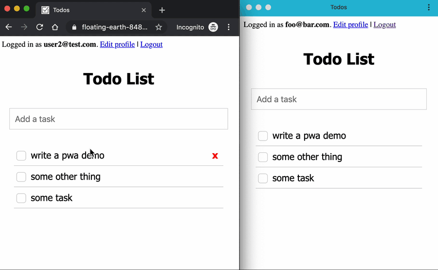

# Progressive Web App Demo using Rails and React

A Todo List with simple multi-user editing using push notifications.



## Setup

You need to generate your own VAPID keys for push notifications to work. See how to do it using the `web-push` library's [docs](https://github.com/web-push-libs/web-push#usage).

You need to set both `VAPID_PUBLIC_KEY` and `VAPID_PRIVATE_KEY` variables.

Dependencies:

- ruby
- bundle
- yarn
- node
- postgresql

To setup, you need to:

```
bundle install
yarn install
rake db:create
rake db:migrate
```

## Run

In development mode

```
rails s
```

Locally in production mode (required to test service worker)

```
yarn run prod
```

## Create a user

```
rails c

irb(main):001:0> User.create(email: 'test@gmail.com', password: 'password123')
```

## Todo

- [ ] Offline support

## Credits

RailsConf 2018: PRPL on Rails (Pearl Latteier & Abraham Williams) http://bw.cm/prpl

JSConf 2019: Build Your first mobile & desktop app as a pwa (Noorulameen & Ritesh Mehrotra) https://github.com/pwa-workshop-2019/sg-clinics-v1
